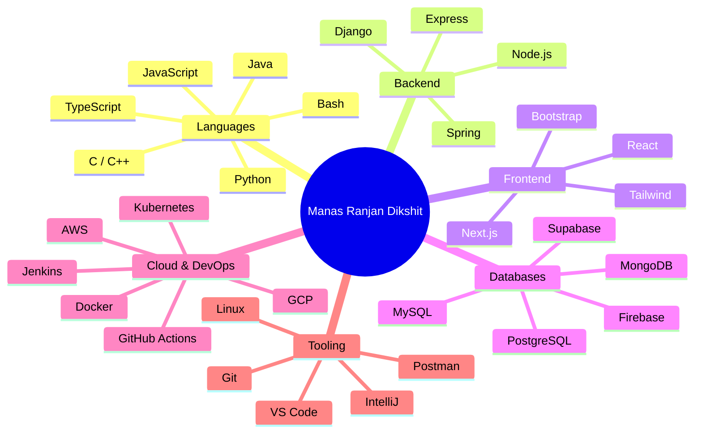

<div align="center">

<pre>
███╗   ███╗ █████╗ ███╗   ██╗ █████╗ ███████╗
████╗ ████║██╔══██╗████╗  ██║██╔══██╗██╔════╝
██╔████╔██║███████║██╔██╗ ██║███████║███████╗
██║╚██╔╝██║██╔══██║██║╚██╗██║██╔══██║╚════██║
██║ ╚═╝ ██║██║  ██║██║ ╚████║██║  ██║███████║
╚═╝     ╚═╝╚═╝  ╚═╝╚═╝  ╚═══╝╚═╝  ╚═╝╚══════╝
</pre>


<p align="center">
  <a href="https://manas-ranjan-dikshit.netlify.app"></a>
  <a href="https://linkedin.com/in/manas-ranjan-dikshit"></a>
  <a href="https://github.com/Manas-Dikshit"></a>
  <a href="https://leetcode.com/u/Manas-Ranjan-Dikshit"></a>
  <a href="mailto:manasdikshit48@gmail.com"></a>
</p>


<br>


</div>

<br>

```
┌──────────────────────────────────────────────────────────────────┐
│ manas@dev-machine  ~  neofetch                                     │
├──────────────────────────────────────────────────────────────────┤
│                                                                    │
│   OS:          Engineer.OS  (Backend/AI Flavor)                   │
│   Host:        Manas-Ranjan-Dikshit                                │
│   Kernel:      Distributed-Systems 5.0                             │
│   Uptime:      Learning since day 1, no reboot                     │
│   Shell:       bash / problem-solving                              │
│   Languages:   Java, Python, C, C++, JavaScript, TypeScript         │
│   DE:          Cloud-Native Architecture                            │
│   Terminal:    VS Code / IntelliJ                                   │
│   CPU:         Curiosity @ ∞ GHz                                    │
│   Memory:      Always allocating for new skills                    │
│                                                                    │
└──────────────────────────────────────────────────────────────────┘
```

---

## `$ cat about.md`

I am a software engineer passionate about building intelligent systems, scalable backend architectures, cloud-native applications, and open-source software.

My interests include:

* Artificial Intelligence & Machine Learning
* Backend Engineering
* Distributed Systems
* Cloud Infrastructure
* DevOps & Automation
* System Design
* API Security
* Open Source Development

I focus on creating solutions that combine technical excellence with practical impact.

---

## `$ git log --current-focus`

```diff
+ Building AI-powered applications
+ Contributing to open-source projects
+ Exploring cloud-native architectures
+ Learning distributed systems design
+ Developing production-grade backend services
```

---

## Tech Stack Map



---

## Stack in Detail

<details open>
<summary><b>Languages</b></summary>
<br>
<p align="left">

</p>
</details>

<details open>
<summary><b>Backend</b></summary>
<br>
<p align="left">

</p>
</details>

<details open>
<summary><b>Frontend</b></summary>
<br>
<p align="left">

</p>
</details>

<details open>
<summary><b>Databases</b></summary>
<br>
<p align="left">

</p>
</details>

<details open>
<summary><b>Cloud, DevOps & Infrastructure</b></summary>
<br>
<p align="left">

</p>
</details>

<details open>
<summary><b>Development Environment</b></summary>
<br>
<p align="left">

</p>
</details>

---

## `$ ls engineering-interests/`

<table width="100%">
<tr>
<td width="50%" valign="top">

```
drwxr-xr-x  Artificial-Intelligence/
drwxr-xr-x  Machine-Learning/
drwxr-xr-x  Backend-Systems/
drwxr-xr-x  Distributed-Computing/
drwxr-xr-x  Cloud-Architecture/
```

</td>
<td width="50%" valign="top">

```
drwxr-xr-x  DevOps/
drwxr-xr-x  Software-Architecture/
drwxr-xr-x  Performance-Engineering/
drwxr-xr-x  Open-Source/
```

</td>
</tr>
</table>

---

## GitHub Statistics

<p align="center">
  
  
</p>
<p align="center">
  
</p>

---

## Contribution Activity

<p align="center">
  
</p>

---

## GitHub Achievements

<p align="center">

</p>

---

## Contribution Snake

<p align="center">
  
</p>

---

## `$ curl open-source/interests`

```json
{
  "interested_in": [
    "Apache Ecosystem",
    "Cloud Infrastructure",
    "Developer Tools",
    "DevOps Platforms",
    "Artificial Intelligence",
    "Machine Learning",
    "Backend Frameworks"
  ],
  "belief": "learning through collaboration, contributing back to the community"
}
```

---

## Connect

<p align="center">
  <a href="https://linkedin.com/in/manas-ranjan-dikshit"></a>
  <a href="https://github.com/Manas-Dikshit"></a>
  <a href="https://leetcode.com/u/Manas-Ranjan-Dikshit"></a>
  <a href="https://youtube.com/@AapkaMRD"></a>
  <a href="https://instagram.com/manasss01_"></a>
  <a href="mailto:manasdikshit48@gmail.com"></a>
</p>

---

## `$ cat philosophy.txt`

```text
> Build useful systems.
> Solve meaningful problems.
> Learn continuously.
> Share knowledge openly.
```

---

<div align="center">

```javascript
class ManasRanjanDikshit extends SoftwareEngineer {
  constructor() {
    super();
    this.role   = "Software Engineer";
    this.focus  = ["AI Systems", "Distributed Systems", "Cloud", "Open Source"];
    this.motto  = "Building technology that creates measurable impact.";
  }

  currentlyBuilding() {
    return "something scalable, something intelligent.";
  }
}

const manas = new ManasRanjanDikshit();
console.log(manas.motto);
// > Building technology that creates measurable impact.
```


</div>
